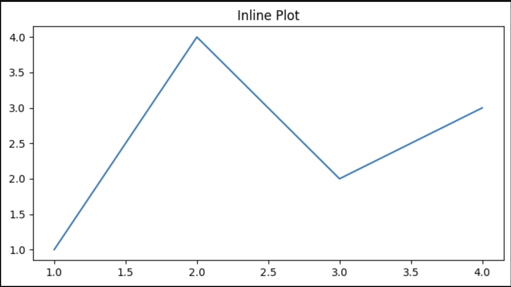
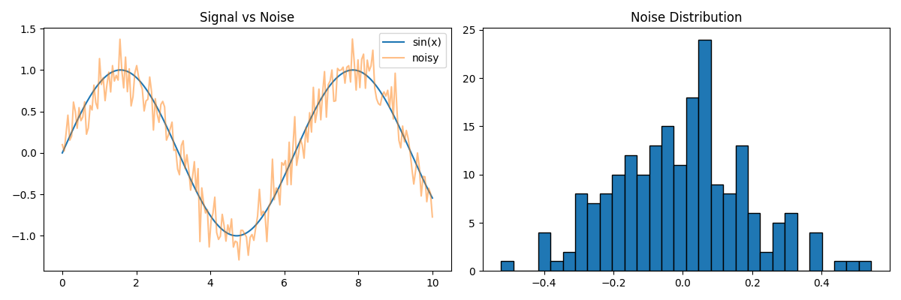

# VsCode + Jupyter Notebook

> Every AI paper, tutorial, and Kaggle competition uses Jupyter notebooks. They let you run code in pieces, see outputs inline, mix code with explanations, and iterate fast. If you try to learn AI without notebooks, you're doing math homework without scratch paper.

## Install VsCode
```
brew install --cask visual-studio-code
```

## Install Extensions in VsCode
Look at the left sidebar, click on "Extensions" tab and install:
- Python
- Pylance
- Jupyter
- GitLens
- Live Server

## Or Install JupyterLab
```
pip3 install jupyterlab
jupyter lab
```

## Shortcuts

| Key | Action |
|-----|--------|
| `Tab` | Autocomplete |
| `Shift+Enter` | Run Cell |
| `Command+B` | Show/Hide Sidebar |
| `Command+Shift+L` | Open new terminal |
| `Command+Shift+[ or ]` | Switch terminal |

## Cell types
```
import numpy as np
data = np.random.randn(1000)
data.mean(), data.std()
```

Output:
```
(np.float64(0.013735607755244222), np.float64(1.0060696949755465))
```

> Markdown cells render formatted text. Use them to document what you're doing and why. Supports headers, bold, italic, LaTeX math ($E = mc^2$), tables, and images.

## Magic commands

These aren't Python. They're Jupyter-specific commands that start with % (line magic) or %% (cell magic).

### Time your code
```
%timeit np.random.randn(10000)
```

Output:
```
77.3 μs ± 1.5 μs per loop
```

```
%%time
model.fit(X_train, y_train, epochs=10)
```

Output:
```
Wall time: 11.9 μs
```

`%timeit` runs the code many times and averages. `%%time` runs it once. Use `%timeit` for microbenchmarks, `%%time` for training runs.

### Enable inline plots
```
%matplotlib inline
```

Every plt.plot() or plt.show() now renders directly in the notebook.

### Install packages without leaving the notebook
``` 
!pip install scikit-learn
```

## Display rich output inline

Notebooks auto-display the last expression in a cell. But you can control it:

```
import pandas as pd

df = pd.DataFrame({
    "model": ["Linear", "Random Forest", "Neural Net"],
    "accuracy": [0.72, 0.89, 0.94],
    "training_time": [0.1, 2.3, 45.6]
})
df
```

output:

| model | accuracy |training_time |
|-------|----------|--------------|
| 0 | Linear | 0.72 | 0.1 |
| 1 | Random Forest | 0.89 | 2.3 |
| 2 | Neural Net | 0.94 | 45.6 |

This renders a formatted HTML table, not a text dump. Same with plots:

```
import matplotlib.pyplot as plt

plt.figure(figsize=(8, 4))
plt.plot([1, 2, 3, 4], [1, 4, 2, 3])
plt.title("Inline Plot")
plt.show()
```

output: 



The plot appears right below the cell. This is why notebooks dominate AI work. You see the data, the plot, and the code together.

For images:

```
from IPython.display import Image, display
display(Image(filename="notebook_plot.png"))
```

output:



## Use It

**Notebooks vs Scripts: When to use which**

| Use notebooks for | Use scripts for |
|-------------------|-----------------|
| Exploring a dataset | Training pipelines |
| Prototyping a model | Reusable utilities |
| Visualizing results | Anything with `if __name__` |
| Explaining your work | Code that runs on a schedule |
| Quick experiments | Production code |
| Course exercises | Packages and libraries |

The rule: **explore in notebooks, ship in scripts**.

A common workflow in AI:
1. Explore data in a notebook
2. Prototype your model in the notebook
3. Once it works, move the code to `.py` files
4. Import those `.py` files back into the notebook for further experiments
